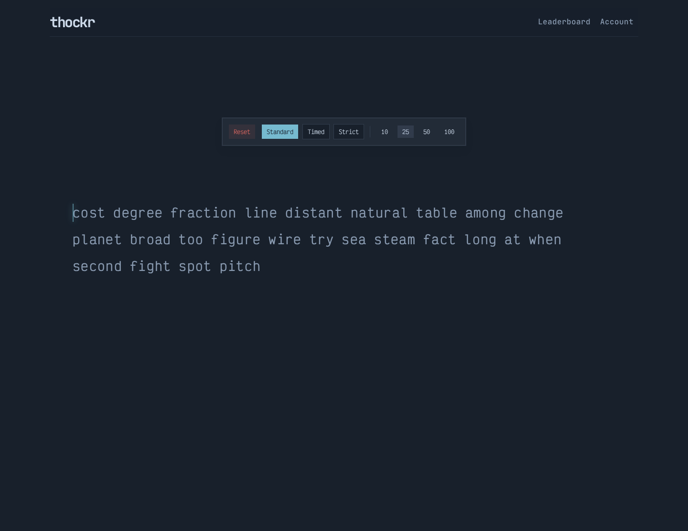
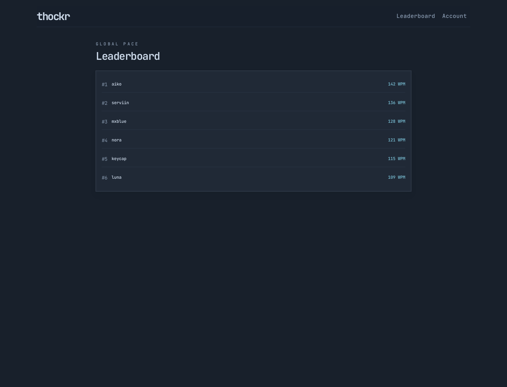
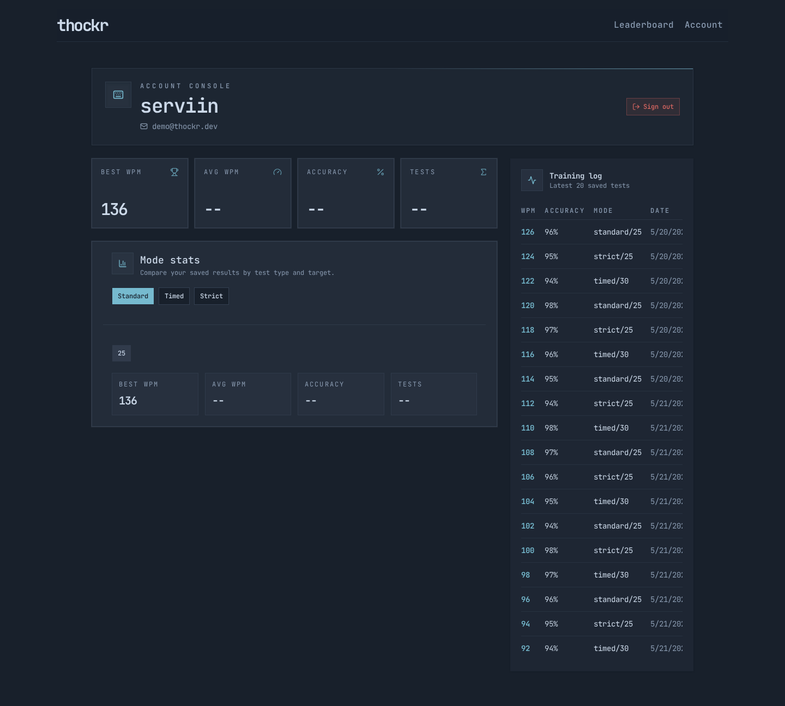
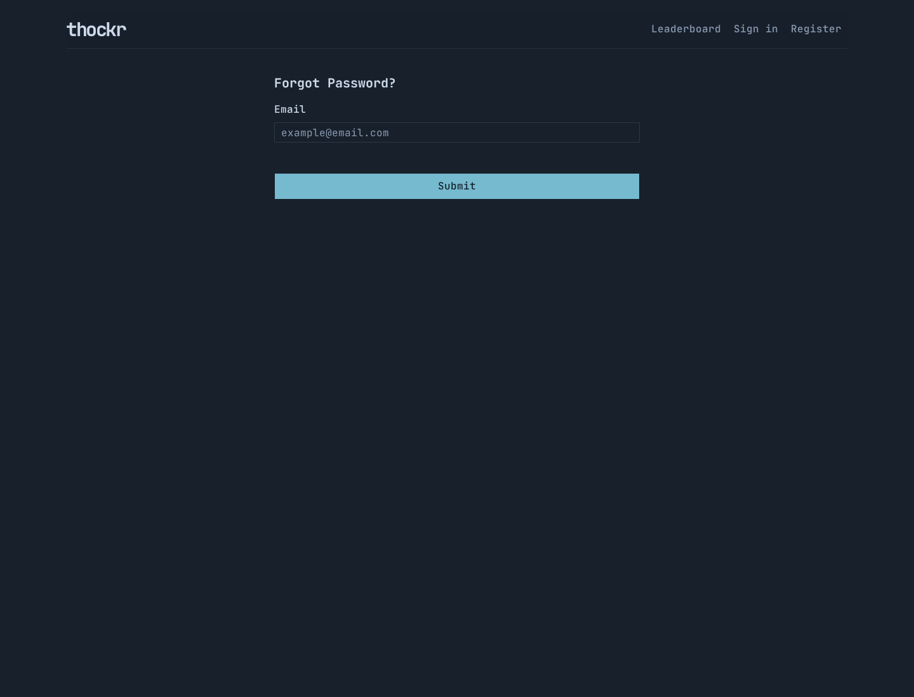
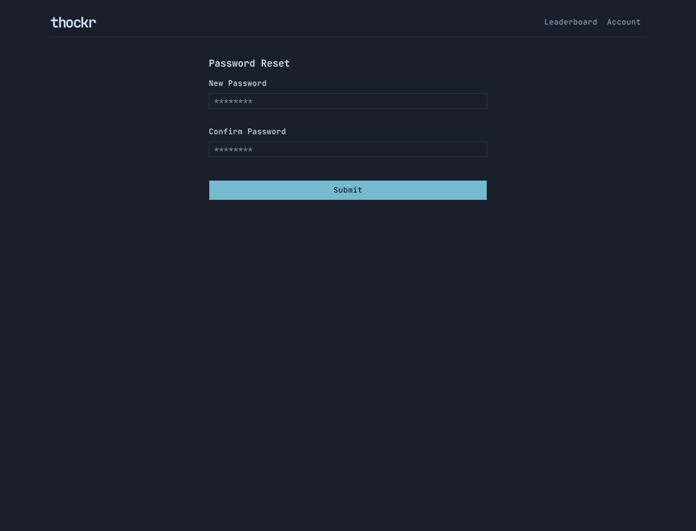

# thocktype

**thocktype** is a full-stack typing test application built to explore real-time typing mechanics, authentication, persistent user stats, and competitive typing features. The current version includes a polished single-player typing experience with account-based result tracking, leaderboard support, and a shared TypeScript typing engine designed to be reused across the frontend and backend.



## Screenshots

| Typing test | Leaderboard |
| --- | --- |
|  |  |

| Account dashboard | Sign in |
| --- | --- |
|  |  |

| Register | Forgot password |
| --- | --- |
|  |  |



> This README is temporary and will evolve as the project moves toward deployment and contribution-ready documentation.

## Project Status

thocktype is currently under active development. The core typing experience, authentication flow, backend API, database schema, and shared typing engine are in place. Upcoming work will focus on multiplayer, richer customization, analytics, deployment, and contributor documentation.

## What It Does Today

- Interactive typing test with live typing feedback
- Multiple test modes, including standard, strict, and timed strategies
- Configurable word count or time-based tests depending on mode
- WPM, accuracy, elapsed time, correct, and incorrect character scoring
- User registration, sign in, sign out, session refresh, and password reset flow
- Authenticated result submission
- Public leaderboard endpoint and frontend page
- Account page with recent results and user statistics
- Rate-limited auth and API routes using Redis
- PostgreSQL-backed persistence for users, sessions, reset tokens, and results
- Shared TypeScript package for engine logic, scoring utilities, contracts, and result/user types

## Why This Project Is Interesting

thocktype is more than a UI exercise. It is structured as a full-stack monorepo with clear separation between frontend, backend, and shared domain logic.

Some implementation highlights:

- **Custom typing engine**: Core typing behavior is implemented in a reusable TypeScript engine rather than being tightly coupled to React components.
- **Strategy-based modes**: Typing modes are modeled with a strategy pattern, making future modes easier to add.
- **Shared package architecture**: The frontend and backend both consume shared contracts, types, scoring logic, and engine utilities.
- **Production-minded backend**: The API includes authentication, session tokens, password reset tokens, Redis-backed rate limiting, error middleware, and database migrations.
- **Modern frontend stack**: The client uses React, TypeScript, Vite, Tailwind CSS, shadcn-style UI components, Zustand, React Query, and React Router.

## Tech Stack

### Frontend

- React 19
- TypeScript
- Vite
- React Router
- TanStack React Query
- Zustand
- Tailwind CSS
- shadcn-style UI components
- Zod

### Backend

- Node.js
- Express 5
- TypeScript
- PostgreSQL
- Redis
- JWT authentication
- bcrypt password hashing
- Resend integration for password reset emails

### Tooling & Architecture

- pnpm workspaces
- Monorepo structure
- Docker Compose for local Postgres and Redis
- Vitest for tests
- Shared internal package: `@thocktype/shared`

## Repository Structure

```txt
apps/
  frontend/   React/Vite client application
  backend/    Express API, auth, results, migrations, rate limiting

packages/
  shared/     Shared typing engine, scoring, contracts, and TypeScript types
```

## Current Features

### Typing Experience

- Word-by-word typing flow
- Overflow handling for extra characters
- Backspace behavior inspired by modern typing test tools
- Live caret tracking
- Test reset and mode selection
- Time-based and word-count-based sessions
- Session result summary with WPM and accuracy

### Authentication & Account System

- Register and sign in
- Sign out
- Session-token flow
- Protected account page
- Forgot password and reset password flow
- User-specific result history and stats

### Leaderboard & Results

- Authenticated result submission
- Public leaderboard
- Account-level recent results
- Per-mode stats support

## Planned Features

The following features are planned for future iterations:

- **Multiplayer races** with real-time competition
- **Tournament modes** for structured competitive events
- **Themes** and deeper visual customization
- **Email verification** for new accounts
- **Custom quotes** and user-generated typing prompts
- **Analytics dashboards** for typing trends, consistency, and improvement over time
- **Production deployment**
- **CI/CD pipeline** for automated checks and releases
- Complete local development and contributor setup documentation

## Development Notes

Local setup documentation is still being finalized. The project already includes Docker Compose support for PostgreSQL and Redis, plus pnpm workspace scripts for running the frontend and backend together.

A more complete contributor guide will be added soon, including:

- Environment variable setup
- Database migration instructions
- Local development commands
- Testing workflow
- Contribution guidelines

## Testing

The codebase includes Vitest-based tests for core backend and typing engine behavior. More coverage will be added as the app moves closer to deployment.

## License

This project currently includes a license file in the repository. See [`LICENSE`](./LICENSE) for details.
